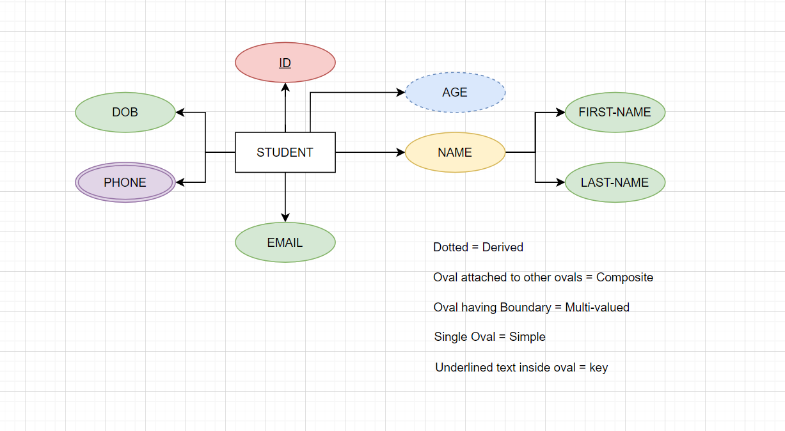

### ER Diagram
    - In Relation model we use sets.
    - In ER model we use Entity and Relationship
    - Currently we are using ER diagram

### Entity 
    - A real world object that is distinguishable from other objects in real world.

    1. Tangible Entities
        - Entities which has physical presence.
        Ex: Cars, Books, etc.
    2. Non-Tangible Entities
        - Entities which do not have physical prsence.
        Ex: Emailid's, Phone numbers, etc.

### Attribute
    - A Entity property or properties of real world object.

### Data Integrity
* Inserting Duplicate rows into table is not allowed.
* Database don't allow values with invalid datatypes.
* Database didn't allow to delete referenced rows which    causes inconsistency

#### Entity Integrity :
        - It Ensures rows are unique.
        - PK(unique and not null)
#### Domain Integrity :
        - It Ensures that the table values follow table Structure.
        Ex: Datatype of values under same attribute is to be same, Following NULL rule, Date format should be followed, range of values, size of values should be satisfied.
#### Referential Integrity :
        - It ensures that insertion of Referenced values exist.
        Ex:
        Teacher

        |   teacher-name     |   age    |
        --------------------------------
        |   Raveena          |   57     |
        --------------------------------
        |   Olive            |   49     |

        Student

        |   student-name    |   age     |       class       |       teacher-name        |
        --------------------------------------------------------------------------------
        |   Tondon          |   23      |       16          |       Raveena             |
        --------------------------------------------------------------------------------
        |   Ravi            |   21      |       15          |       olive               |

        If we try to insert a value which is not in teacher table it will throw an error
    
### Entity Relationship Model
*   Entity is nothing but table, Relatioships between tables is Entity Relationship Model.

* Entities are represented in rectangles.
* Attributes are represented in ellipse.
    - simple atrribute: atomic and single valued.
    - key attribute : The attribute, which is a key(primary key, super key, ) underline the simple attribute
    - Derived attribute : store in database. Calculated from another attribute. It is represented using dotted ellipse.
    - Multi-valued attribute : collection of values. Ex: group of emails, group of interests, etc. It is represented in double ellipse.
    - Composite attribute : combination of multiple sub attributes. (Ex: name - first-name+middle-name+last-name).
Ex :

### Relationship
* Interaction between Entities.
Ex: Student is a part of Batch.
    Batch is taught by Instructor.
* In ER Diagram it is represented using Rhombus.
* Relatioship is dependent on cardinality.